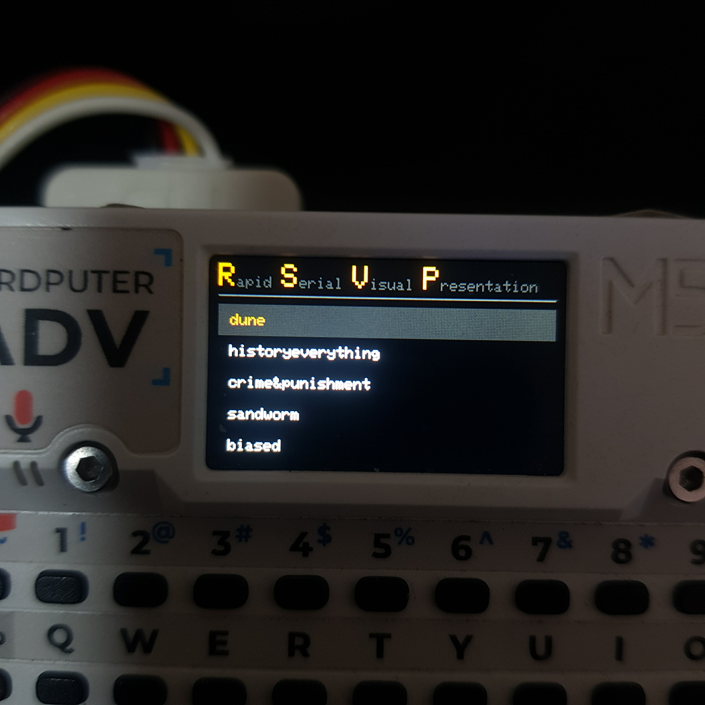

# rsvp
---

Rapid Serial Visual Presentation - an ebook reader for the m5cardputer

---

home screen



---

## Building

```
git clone https://github.com/wisnc/rsvp
cd rsvp
pio run
```

## Installing

Just flash it with any launcher. or from the M5Burner.

Check releases for the latest binary

## How to use

your SD must have the file structure for ebooks as

```
ebooks/
├─ BookName1/
│  ├─ read.txt
│  └─ prog.txt
├─ BookName2/
│  ├─ read.txt
│  └─ prog.txt
└─ Sample_Book_A/
   ├─ read.txt
   └─ prog.txt
```
read.txt should contain the entire book in text file. each word will be separated by either a newline or space
prog.txt should be 0 for no progress. the value refers to the amount of characters already read as progress


## Version History / Changelog

### v1.0

- Public release
- GitHub repository created
