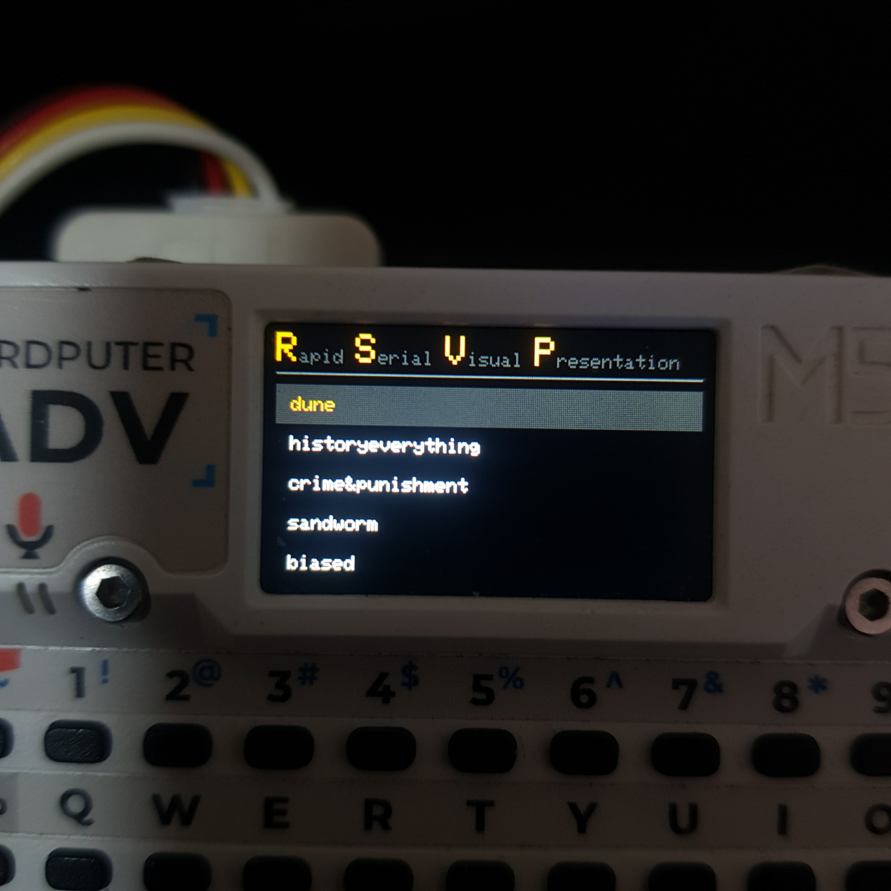
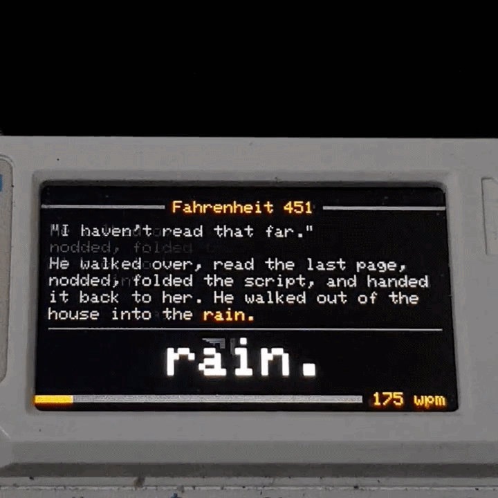

# rsvp
---

Rapid Serial Visual Presentation - an ebook reader for the m5cardputer

---

home screen



read screen



---

## Building

```
git clone https://github.com/wisnc/rsvp
cd rsvp
pio run
```

## Installing

Just flash it with any launcher. or from the M5Burner.

Check releases for the latest binary

or [shameless plug](https://github.com/wisnc/crub)

## How to use

your SD must have the file structure for ebooks as

```
/ebooks/
├─ BookName1/
│  ├─ read.txt
│  └─ prog.txt
├─ BookName2/
│  ├─ read.txt
│  └─ prog.txt
└─ Sample_Book_A/
   ├─ read.txt
   └─ prog.txt
```
read.txt should contain the entire book in text file. each word will be separated by either a newline or space
prog.txt should be 0 for no progress. the value refers to the amount of characters already read as progress

easiest way to convert to .txt is through https://convertio.co/epub-txt/
otherwise use the epub2txt.py from the project

Up - faster wpm

Down - slower wpm

Left - previous word

Right - next word

plus (+) - brighter display

minus (-) - dimmer display

backspace - exit to home

## ASCII conversion

as you know, the default encoding or font of the cardputer is limited by ascii printable. so books that contain UTF-8 characters cannot be displayed, provided on this repo is a script that can easily convert all the characters in your text to alternative characters that can be displayed by the cardputer

```
cd ebooks
python ascii-auto.py
```

run this command in /ebooks/

this script checks out all directories beside it and converts all .txt

**fun fact!** you can run this python script on micropython within the cardputer. use a micropython firmware

## Version History / Changelog

### 2.1

- persistent settings
  
- start on pause

### 2.0

- massive change on the UI

- upload python tool

### 1.0

- Public release
- GitHub repository created
